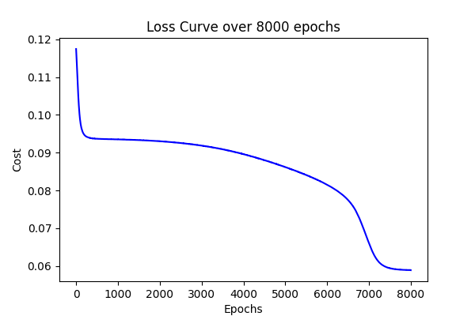

# NeuralBytes: From-Scratch Implementations of Neural Architectures


## Table of Contents

1. [Introduction](#introduction)  
2. [Repo Structure](#repo-structure)  
3. [Setup](#setup)  
4. [Implemented Architectures](#implemented-architectures)  
    - [Multi-Layer Perceptron (MLP)](#multi-layer-perceptron-mlp)  
    - [Convolutional Neural Network (CNN)](#convolutional-neural-network-cnn)  
    - [Recurrent Neural Network (RNN)](#recurrent-neural-network-rnn)  
    - [Long Short-Term Memory (LSTM)](#long-short-term-memory-lstm)  
5. [Manual Calculations](#manual-calculations)  
6. [Running the Tests](#running-the-tests)  
7. [Experiments & Results](#experiments--results)  
    - [MLP Experiments](#mlp-experiments)  
    - [CNN Experiment](#cnn-experiment)  
    - [RNN Experiments](#rnn-experiments)  
    - [LSTM Experiments](#lstm-experiments)  
8. [Conclusions & Insights](#conclusions--insights)  

## Introduction

NeuralBytes is a pure Python package demonstrating how to implement several neural architectures from scratch, without using any external deep learning frameworks. In this repo, you will find:

- A simple **Multi-Layer Perceptron (MLP)** for binary classification.  
- A minimalistic **Convolutional Neural Network (CNN)** that performs a single convolution layer.
- A character-level and word-level **Recurrent Neural Network (RNN)** with backpropagation through time (BPTT). 
- A character-level and word-level **Long Short-Term Memory (LSTM)** network with gate-by-gate backpropagation.

Each model is implemented using plain Python lists and loops. The low-level matrix operations (multiplication, transpose, elementwise arithmetic) and activation functions (sigmoid, ReLU, tanh, softmax, and their derivatives) are defined in `utils.py` and `activations.py`.

## Repo Structure


- **`neural_bytes/`**: Python package containing implementations of MLP, CNN, RNN, LSTM, plus utility modules.  
- **`mlp_by_hand.pdf`** & **`rnn_by_hand.pdf`**: Manual calculation for MLP and RNN to verify backpropagation steps and understanding the logic behind each approach.
- **`plots_mlp/`**, **`plots_rnn/`**, **`plots_lstm/`**: Loss vs. epochs curves for various experiments.  
- **`test_*.py`**: Example scripts demonstrating how to train and evaluate each model.  
- **`predictions.txt`**: Log of MLP predictions and accuracies for different hyperparameters.  
- **`requirements.txt`**: Contains `matplotlib` (this is optional for visualization purposes).


## Setup

1. Clone the repository
    ```bash
    git clone git@github.com:ramosv/NeuralBytes.git
    ```

2. Go into the project directory
    ```bash
    cd NeuralBytes
    ```

Thats it, the package has no further dependencies to install.

**Note**: If you would like to plot the loss/epoch then you will need to install `matplotlib` via `pip install matplotlib`


No other dependencies are required. All code is built using Python standard library functions.

## Implemented Architectures

### Multi-Layer Perceptron (MLP)

- Implements a 2-layer feedforward neural network (up to two neurons per hidden layer, configurable up to N hidden layers).
- Uses **sigmoid** activations and **mean squared error (MSE)** loss.
- Forward pass:
    1. Compute $Z^{[l]} = W^{[l]}\,A^{[l-1]} + b^{[l]}$
    2. Apply $\sigma(Z^{[l]})$ to get $A^{[l]}$

- Backward pass: Elementwise derivatives of sigmoid, computing $\delta^{[l]}$, $dW^{[l]}$, $db^{[l]}$.

- Parameter update: Gradient descent with learning rate $\alpha$.
- **HyperParameters**:

    - Number of hidden layers (`hidden_layer`)
    - Learning rate (`lr`)
    - Number of epochs (`epochs`)

- **Matrix operations**: All matrix multiplications, transposes, elementwise additions/subtractions are manually implemented in `utils.py`. These are reused across all architectures.

### Convolutional Neural Network (CNN)

- Single 2D convolutional layer with num\_filters filters of size `(filter_height × filter_width)`.
- ReLU activation on convolution outputs.
- Flattening of all activated feature maps into a single vector.
- Fully connected layer mapping to `num_classes` outputs (sigmoid for binary, softmax for multi-class).
- Loss:
    - **Binary (num\_classes=1)**: MSE
    - **Multi-class**: Cross-entropy

- Backpropagation:
    1. Compute gradients of FC weights/biases.
    2. Backpropagate through flattened ReLU maps, zeroing gradients where activation ≤ 0.
    3. Accumulate filter gradients by convolving each $\,d\!Conv$ map with the original input.

- **HyperParameters**

  - `filter_size`, `num_filters`, `num_classes`, `epochs`, `lr`.

### Recurrent Neural Network (RNN)

- Character-level and word-level RNN with a single hidden layer (size `hidden_size`) and BPTT.

- Input one-hot vectors of dimension `vocab_size` -> hidden state $h_t = \tanh(U\,x_t + W\,h_{t-1} + b)$.

- Output $z_t = V\,h_t + c$, $p_t = \text{softmax}(z_t)$.
- Loss: Cross-entropy over the sequence.

- Gradients:
    1. Compute $\,dy_t = p_t - y_t$.
    2. Backpropagate through $V$, propagate $\,dh_t = V^T\,dy_t + dh_{t+1}$.
    3. Apply $\tanh'$ to get $\,dh_{\text{raw}}$, accumulate into $dU, dW, db$.
    4. Clip all gradients to $\pm \text{clip\_value}$.

- Parameter update via Adagrad.
- Sampling:
    - Given a seed index and hidden state, repeatedly sample next character/word from the softmax distribution to generate sequences of length `n`.

### Long Short-Term Memory (LSTM)

- Character-level and word-level LSTM with gates: forget ($f_t$), input ($i_t$), output ($o_t$), and cell candidate ($g_t$).

- Equations per time step $t$:

    1. $f_t = \sigma(W_f\,h_{t-1} + U_f\,x_t + b_f)$
    2. $i_t = \sigma(W_i\,h_{t-1} + U_i\,x_t + b_i)$
    3. $g_t = \tanh(W_c\,h_{t-1} + U_c\,x_t + b_c)$
    4. $c_t = f_t \odot c_{t-1} \;+\; i_t \odot g_t$
    5. $o_t = \sigma(W_o\,h_{t-1} + U_o\,x_t + b_o)$
    6. $h_t = o_t \;\odot\; \tanh(c_t)$
    7. $z_t = V\,h_t + c$, $p_t = \text{softmax}(z_t)$

- **Loss**: Cross-entropy over the sequence.
- **Backpropagation through time**:

    - Compute $\,dy_t = p_t - y_t$, accumulate $dV$, $dc$.
    - Backprop through $h_t$, $c_t$, and each gate:

        1. $do = dh \odot \tanh(c_t)$, $dW_o, dU_o, db_o$ via $\sigma'(o_t)$.
        2. $dct = dh \odot o_t \odot \tanh'(c_t) + dc_{t+1}$.
        3. $df = dct \odot c_{t-1}$, $dW_f, dU_f, db_f$ via $\sigma'(f_t)$.
        4. $di = dct \odot g_t$, $dW_i, dU_i, db_i$ via $\sigma'(i_t)$.
        5. $dg = dct \odot i_t$, $dW_c, dU_c, db_c$ via $\tanh'(g_t)$.
        6. Propagate $dh_{t-1}$ and $dc_{t-1}$.
    - Clip all gradients then update via Adagrad.

- Sampling: Similar to RNN but with cell state $c_t$ carried along.

## Manual Calculations

Two PDF files walk through the math by hand. These were instrumental for debugging and ensuring correctness of backpropagation steps and understanding of each algorithm.

- **MLP by Hand**: [mlp\_by\_hand.pdf](mlp_by_hand.pdf)
- **RNN by Hand**: [rnn\_by\_hand.pdf](rnn_by_hand.pdf)

## Running the Tests

Each architecture has a corresponding test script:

1. **MLP**

    ```bash
    python test_mlp.py
    ```

    - Trains a tiny MLP on a toy dataset (`X = [[0,0,1,1],[0,1,0,1]]`, `Y = [[0,1,1,1]]`).
    - Outputs predictions and accuracy to `predictions.txt`.
    - You can adjust `epochs`, `lr`, and `hidden_layer` directly in the script.

2. **CNN**

   ```bash
   python test_cnn.py
   ```

    - Expects CIFAR-10 batches unzipped in `./cifar-10-batches-py/`.
    - Loads 100 images from each batch, converts to grayscale via `rgb_to_grey()`, then trains a CNN (3×3 filters, 4 filters, 10 classes).
    - Prints test accuracy (70/30 train-test split).

3. **RNN**

   ```bash
   python test_rnn.py
   ```

    - Uses the`./JulesVerde/` folder at the root, which contains example of JulesVerde books (“The Mysterious Island.txt”, “Around the World in Eighty Days.txt”).
    - Runs both character-level and word-level experiments using an RNN (hidden size 128, seq\_length 50, lr 0.01, epochs 100).
    - Displays loss vs. epochs plot (requires `matplotlib`).
    - Prints sampled text at epochs {20, 40, 60, 80, 100}.

4. **LSTM**

   ```bash
   python test_lstm.py
   ```

    - Same folder requirements (`./JulesVerde/`).
    - Runs both character-level and word-level LSTM experiments (hidden size 128, seq\_length 50, lr 0.01, epochs 100).
    - Displays loss vs. epochs plot (requires `matplotlib`).
    - Prints sampled text at epochs {20, 40, 60, 80, 100}.

## Experiments & Results

### MLP Experiments

For the MLP, I performed an extensive hyperparameter sweep testing various combinations of epochs and learning rates. Below are the most illustrative loss curves showing how training progresses over epochs.

|                      Loss Curve (10,000 epochs, lr=0.0001)                     |                    Loss Curve (10,000 epochs, lr=0.1)                    |
| :----------------------------------------------------------------------------: | :----------------------------------------------------------------------: |
|  |  |

|                     Loss Curve (8,000 epochs, lr=0.001)                    |                    Loss Curve (8,000 epochs, lr=0.1)                   |
| :------------------------------------------------------------------------: | :--------------------------------------------------------------------: |
|  |  |

|                     Loss Curve (6,000 epochs, lr=1e-6)                    |                     Loss Curve (6,000 epochs, lr=0.0001)                     |
| :-----------------------------------------------------------------------: | :--------------------------------------------------------------------------: |
|  |  |

|                     Loss Curve (4,000 epochs, lr=0.0001)                     |
| :--------------------------------------------------------------------------: |
|  |

|                    Loss Curve (2,000 epochs, lr=0.1)                   |                     Loss Curve (2,000 epochs, lr=0.0001)                     |
| :--------------------------------------------------------------------: | :--------------------------------------------------------------------------: |
|  |  |

|                     Loss Curve (1,000 epochs, lr=0.0001)                     |
| :--------------------------------------------------------------------------: |
|  |

|                      Loss Curve (500 epochs, lr=0.001)                     |                     Loss Curve (500 epochs, lr=0.1)                    |
| :------------------------------------------------------------------------: | :--------------------------------------------------------------------: |
|  |  |

|                     Loss Curve (200 epochs, lr=0.01)                     |                     Loss Curve (200 epochs, lr=0.1)                    |
| :----------------------------------------------------------------------: | :--------------------------------------------------------------------: |
|  |  |

|                     Loss Curve (100 epochs, lr=0.01)                     |                     Loss Curve (100 epochs, lr=0.1)                    |
| :----------------------------------------------------------------------: | :--------------------------------------------------------------------: |
|  |  |

**Observation**:

- Smaller learning rates (1e-4) tend to converge steadily over thousands of epochs, whereas larger rates (0.1) cause rapid initial drops but may oscillate or diverge if too large.
- Epochs in the range 1,000–10,000 were needed for stable convergence at small lr.

### CNN Experiment

**Dataset**: CIFAR-10 (500 images total, 5 batches × 100 images)

**Preprocessing**: Converted RGB images to grayscale normalized to \[0, 1] via `rgb_to_grey()`.

**Model**: Single convolutional layer (4 filters of size 3×3, stride=1, no pooling), ReLU activation, flattened to a 1×((32-3+1)×(32-3+1)×4) vector, then a softmax output layer for 10 classes.

**Hyperparameters**:

- `filter_size=(3,3)`, `num_filters=4`, `epochs=50`, `lr=1e-3`, `num_classes=10`.

**Result**:

- **Test Accuracy**: Typically in the low 20–30% range on 150–200 test images (70/30 split).
- This demonstrates the correctness of convolution and backprop, albeit accuracy is low due to minimal architecture and small sample size.

```text
Epoch 10/50, Cost: 2.2791
Epoch 20/50, Cost: 2.0504
Epoch 30/50, Cost: 1.8229
Epoch 40/50, Cost: 1.5603
Epoch 50/50, Cost: 1.2269
Test Accuracy: 17.33%
```

### RNN Experiments

**Data**: Full‐length novels from Jules Verne (in `./JulesVerde/`).

**Char-level RNN**:

**Vocabulary**: 256 ASCII characters (one-hot).
**Hyperparameters**: `hidden_size=128`, `seq_length=50`, `learning_rate=0.01`, `epochs=100`, `sample_len=40`.
**Loss Curve**:


Rapid decline from \~275 to \~150 in first 20 epochs, then plateaus \~140–160.

**Sampled Text (epoch 100)**:

```
tmdil ttmml ...
```

Mostly gibberish with occasional character patterns.

**Word-level RNN**:

**Vocabulary**: Top 5,000 words (one-hot).
**Hyperparameters**: `hidden_size=128`, `seq_length=50`, `learning_rate=0.01`, `epochs=100`, `sample_len=200`.

**Loss Curve**:


Starts \~425, descends to \~320–360 with noisy fluctuations.

**Sampled Text (epoch 100)**:

```
is should steam such to responded or ages, tempted doubtless anyway.” xi. and after
```

(Valid English words appear, though grammar is rough.)

**Total Running Times**:

- Char-level RNN: \~139 seconds
- Word-level RNN: \~2,457 seconds (≈ 41 minutes)

### LSTM Experiments

**Char-level LSTM**:

**Vocabulary**: 256 ASCII characters.
**Hyperparameters**: `hidden_size=128`, `seq_length=50`, `learning_rate=0.01`, `epochs=100`, `sample_len=40`.

**Loss Curve**:


Similar to RNN: rapid drop to \~150 by epoch 20, then fluctuates \~140–180.

**Sampled Text (epoch 100)**:

```
s a ...
```

Gibberish with occasional real‐character fragments.

**Word-level LSTM**:

**Vocabulary**: Top 5,000 words.
**Hyperparameters**: `hidden_size=128`, `seq_length=50`, `learning_rate=0.01`, `epochs=100`, `sample_len=50`.
**Loss Curve**:


Drops from \~425 to \~280 by epoch 100 (better than RNNs \~320).

**Sampled Text (epoch 100)**:

```txt
hearing. carbines, most peak tom the sea the of one to the moon seventy-eight as
```

More coherent phrases and article usage.

**Total Running Times**:

- Char-level LSTM: \~407 seconds
- Word-level LSTM: \~5,776 seconds (≈ 96 minutes)

## Conclusions & Insights

1. **Educational Value**:

    - Implementing each architecture with plain Python lists and loops highlights every step of forward and backward propagation.
    - The manual derivations (`mlp_by_hand.pdf`, `rnn_by_hand.pdf`) were crucial for ensuring correctness, especially for BPTT in RNN/LSTM.

2. **MLP Observations**:

    - Small learning rates (1e-4 to 1e-6) require thousands of epochs to converge on the example dataset.
    - Larger learning rates (0.1) converge faster initially but can oscillate or diverge if too large.

3. **CNN Observations**:

    - Without pooling or multiple layers, accuracy on CIFAR-10 remains low (20–30%).
    - Demonstrates the core convolution/backprop logic correctly; deeper architectures and more data augmentations would be needed for higher accuracy.

4. **RNN vs. LSTM (Char-level)**:

    - Both char-level RNN and LSTM show similar loss curves and sample qualities under these settings.
    - LSTM gating does not yield a marked advantage over RNN for short sequences (50 chars) and only 100 epochs.

5. **RNN vs. LSTM (Word-level)**:

    - Word-level LSTM outperforms word-level RNN quantitatively (loss \~280 vs. \~320 at epoch 100) and qualitatively (more coherent sampled phrases).
    - Larger vocabulary (5,000 words) makes learning harder, and LSTM memory helps capture longer dependencies.

6. **Char vs. Word**:

    - **Char-level** models learn spelling patterns but struggle to assemble full words or syntax within the given epochs.
    - **Word-level** models generate valid English words from the start, producing more readable (though still choppy) text.

7. **Hyperparameter Notes**:

    - Most loss reduction for sequence models happens by epochs 20–40; diminishing returns beyond epoch 60.
    - Hidden size of 128 is sufficient for these toy experiments; increasing to 256 or 512 may improve results at greater compute cost.
    - Sequence length of 50 words captures multi-sentence context; sequence length of 50 chars spans only a few words. Consider longer char sequences (100–200) for richer structure.
