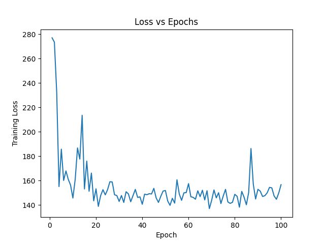
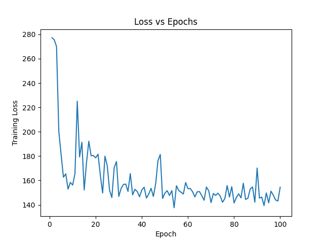

# RNN and LSTM
Vicente Ramos

## 1. Intro  
Trained four sequence models on Jules Verne texts to compare char vs word for both RNN and LSTM architectures.

Used a pure python implementation, building on top of my MLP assigment. I added new functionality to `utils.py` and `activations.py` to support the RNN and LSTM architectures.

Although not required, I performed a manual calculation of the RNN for char-lvl. THis can be found at `rnn_by_hand.pdf`. This was very helpful when it came to building both the RNN and LSTM code. Specially for BPTT.

### Set-up

Follow these steps in your terminal to get started:

1. **Clone the repository**
```bash
git clone git@github.com:ramosv/NeuralBytes.git
```

2. **Navigate into the project directory**
```bash
cd NeuralBytes
```

3. **Create a virtual environment**
```bash
python -m venv .venv
```

4. **Activate the virtual environment**
```bash
source .venv/Scripts/activate 
```

5. **Test the pipeline**
```bash
python test_rnn.py
python test_lstm.py
```

6. **Visualization support**(optional)
If you would like to see a graph of for epochs vs loss. You will need to install matplotlib.
`pip install matplotlib`

1. **Task 1:** Train a char-lvl RNN
2. **Task 2:** Train a char-lvl LSTM
3. **Task 3:** Train a word-lvl RNN
4. **Task 4:** Train a word-lvl LSTM

For each experiment I recorded training loss vs epochs and sampled text at epochs 20, 40, 60, 80, 100** to gauge how well the model learns syntax and semantics over time.

## 2. Experiments  

- **Data:** Full texts from Gutenberg. These are locat4ed at dir `./JulesVerde`
- **Char-lvl**: one-hot over 256 ASCII codes
- **Word-lvl**: one-hot over the 5000 most frequent words
- **Tested with the following hyperparams**:  
    - Hidden size = 128
    - Sequence length = 50 chars or words
    - Learning rate = 0.01
    - Epochs = 100
    - Sample length = 40 chars or words
    - Breakpoints = {20, 40, 60, 80, 100} (This is hard coded at the moment)

## 3. Results

All terminal output is availble at `./rnn_lstm_output.txt`

### 3.1 Task 1: Char-lvl RNN  

  

- **Loss curve** drops sharply in the first 10–20 epochs (from around 275 to around 150), then plateaus around 140–160.  

- **Samples** improve from gibberish at epoch 20 (`llwltr`) to slightly more readable fragments by epoch 100 (`tmdil ttmml`), but remain largely poor.

- **Total running time**: 139.0 seconds

### 3.2 Task 2: Char-lvl LSTM  

  

- **Loss behavior** is very similar to the RNN: rapid drop to around 150 by epoch 20, then noisy fluctuations 140–180.

- **Samples** show comparable quality to the RNN-still mostly char-lvl noise with occasional two-letter real words (`s`, `a`) by epoch 100.

For this test size and training, the LSTM did not markedly outperform the simpler RNN at the char lvl.

- **Total running time**: 407.2 seconds

### 3.3 Task 3: Word-lvl RNN  

  

- **Loss curve** starts around 425 and descends to around 320–360.  Training is much noisier, reflecting larger vocab and sparser one-hot targets. The graph very much represents this as well.

- **Samples** at epoch 100:  
`is should steam such to responded or ages, tempted doubtless anyway.” xi. and after`

While still jumbled, we see full English words (`tempted`, `doubtless`, `anyway`), punctuation and sentence fragments even if grammar is off.

- **Total running time**: 2457.4 seconds (41 minutes)

### 3.4 Task 4: Word-lvl LSTM  

  

- **Loss curve** falls from around 425 to around 280 by epoch 100, slightly lower than the RNNs around 320.  

- **Samples** at epoch 100: 

`hearing. carbines, most peak tom the sea the of one to the moon seventy-eight as`

Better coherence: correct article usage, plausible phrases like `to the moon seventy-eight,` and longer, connected word sequences.

- **Total running time**: 5776.5 seconds (96 minutes)

## 4. Concluision

1. **Char vs Word**: 
- **char‐lvl** models learn spelling and very short patterns but struggle to assemble words and syntax/
- **Word‐lvl** models immediately generate valid words, improving readability even if overall sentence structure remains choppy.

2. **RNN vs LSTM**:
- At the **char lvl**, the extra gating in LSTM didnt yield substantially better loss or samples within 100 epochs
- At the **word lvl** LSTM outperformed RNN both quantitatively (loss around 280 vs 320) and more coherent sentences.

3. **Hyperparameter notes**  
- Most loss reduction happens by epoch 20–40; beyond epoch 60 gains are marginal 
- Hidden size = 128 appears sufficient; doubling to 256/512 may yield modest gains at greater compute cost
- Sequence length = 50 (words) captures multi-sentence context; length = 50 (chars) spans only a few words-try 100–200 chars for richer structure

4. **In SUmmary**
- char‐lvl LSTM does not dramatically beat RNN under these settings 
- Word‐lvl LSTM clearly outperforms RNN, producing more grammatical text

5. **Future work**
- The testing formermed is very limited and further hyperperparamets should be tested to get a better idea of how to optimize each architecture to get the best results